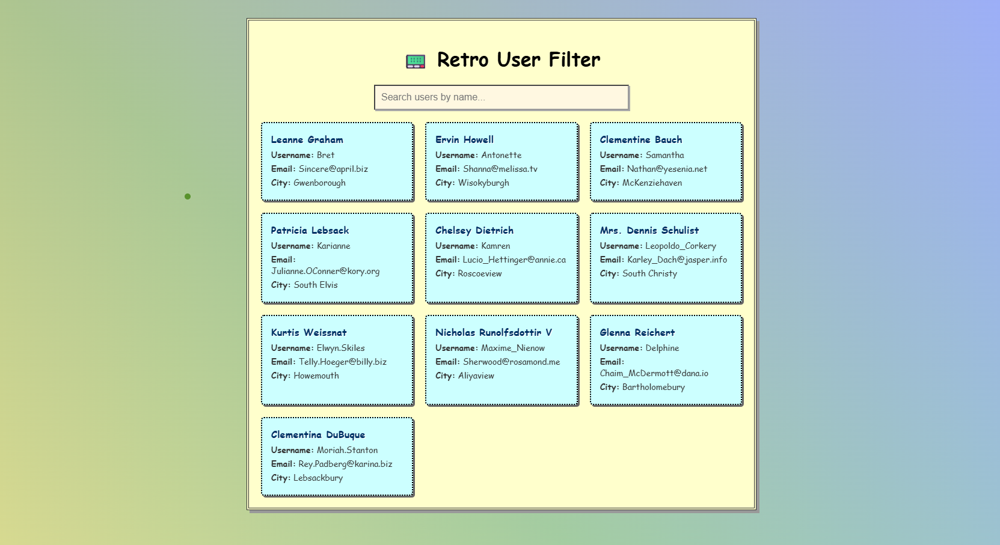
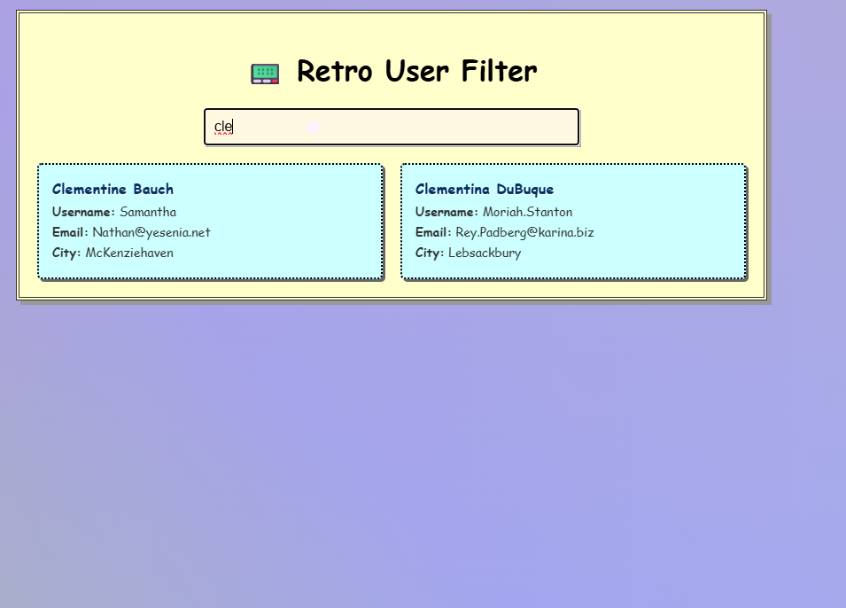

# 🧑‍💻 User Filter System

- A fun and retro-styled user filtering web app built using **HTML**, **CSS**, and **JavaScript**. It fetches data from the free public API [JSONPlaceholder](https://jsonplaceholder.typicode.com/users) and lets users filter through fake user data (name, email, username, city) using a live search input.

## 🔥 Features

- Fetches user data from JSONPlaceholder API
- Filters users by:
  - Name
  - Email
  - Username
  - City
- Live search input with instant filtering
- Custom animated **rainbow background**
- Unique **retro 90s style design**
- Dot-style custom **mouse cursor**
- Fully **responsive layout**

## 🧩 Technologies Used

- HTML5
- CSS3 (with animations, gradients, custom cursor)
- JavaScript (ES6)
- JSONPlaceholder API (https://jsonplaceholder.typicode.com/users)

## 🚀 Getting Started

1. **Clone the repository**

   ```bash

   git clone https://github.com/your-username/user-filter-system.git

   ```

2. **Open index.html in your browser**
   - That's it — no server setup or build step required!

## 📂 Project Structure

    ```bash
    📁 user-filter-system
    ├── index.html
    ├── style.css
    ├── index.js

```


## Screenshot





## [🚀 View Live Demo](https://charudatta270104.github.io/Filter_System_on_UserData/)

```
